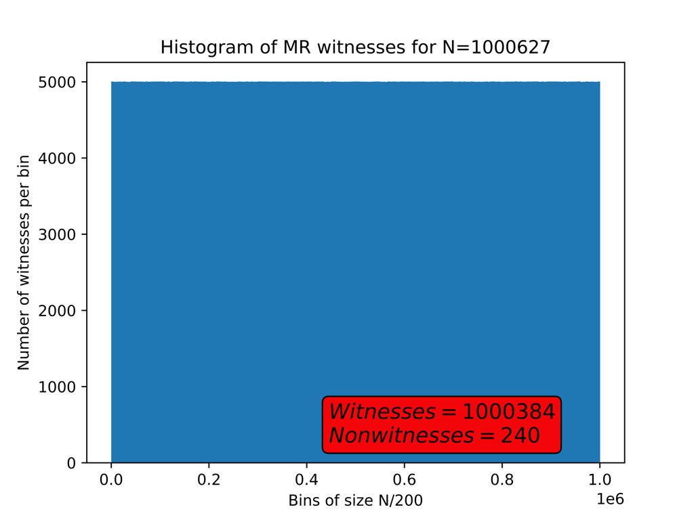
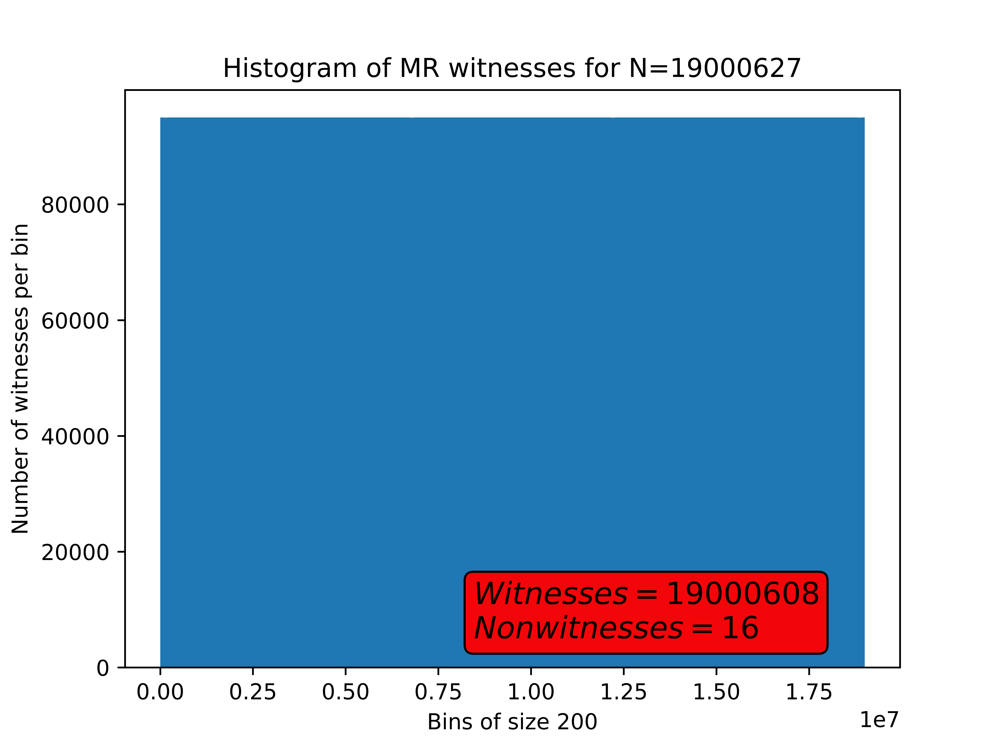
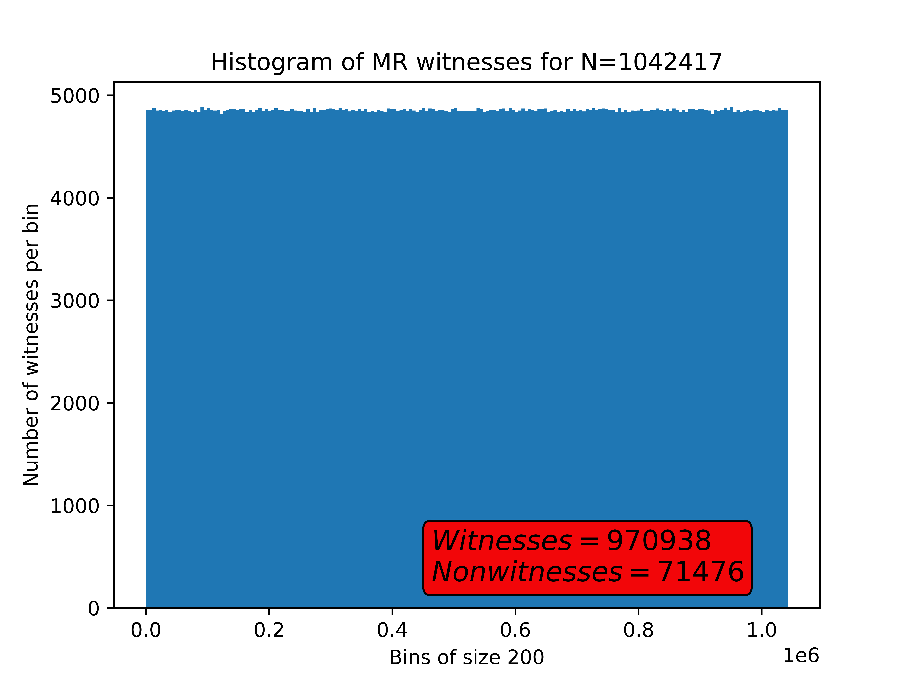

# Investigating the Miller-Rabin Primality Test (Revisited)

This repository hold some revisited and revamped research code from an old project of mine, along with some exposition.

**Table of Contents**
1. [Project Summary](#project-summary)
1. [Background](#background)
1. [Research Code](#research-code-revisited)
1. [Analysis](#data-analysis)
1. [End Results](#end-results)

## Project Summary

This is revisiting and revamping code from an old research project I did while participating in the  [DIMACS Summer 2015 REU](#http://reu.dimacs.rutgers.edu/2015/participants.html). The goal of the project was to numerically investigate the set of Miller-Rabin witnesses for a large range of numbers, propose some hypotheses derived from analyzing the numerics, and then finally investigate any hypotheses from a purely mathematical standpoint. 

Originally back in 2015 I had done all of the data gathering with a small script written in C and produced some graphics with MATLAB. You can find a version of both of these scripts in the repository's ``history`` folder for completeness's sake-- ``WitnessList.C`` was actually the first proper script I ever wrote in C, so it's a bit clunky. 

Here in this repository I have rewritten the data gathering in Rust (for the speed and also as a chance to learn the language) and handled the data visualization with Python.

I won't delve into the mathematical side of things here. I did manage to prove some novel theoretical results that you can find in [this short pre-print](#https://arxiv.org/abs/1608.07317) if you are interested. 

## Background

The [Miller-Rabin primality test](#https://en.wikipedia.org/wiki/Miller%E2%80%93Rabin_primality_test) is a probabilistic test used to determine whether or not a given integer is composite or a "probable prime". Deterministic variants exists (and depending on the size of the input can be quite fast and efficient while being simple to implement) but they are not robust enough to efficiently handle all situations. 

The key mathematical object in the test is called a "witness". Roughly speaking, a "witness" is just another integer that satisfies some modular arithmetic conditions that depend on the candidate that you are running the Miller-Rabin primality test on. For ain given put integer ``N``, every integer ``a`` with ``1<a<N-1`` is either a witness or a non-witness. 

## Research Code Revisited

In the modern code in this repository, I've opted to use a Rust script to efficiently generate the numerical data in sufficient quantities, and then use Python to handle the data visualization. There is also a sample script ``millerrabin.py`` that implements the primality test.

The Rust code in ``main.rs`` has done the following:

- Implement the [exponentiation by squaring]#https://en.wikipedia.org/wiki/Exponentiation_by_squaring) algorithm with modular arithmetic. 
- Implement the actual Miller-Rabin test itself.
- For a given integer, generate the complete set of its Miller-Rabin non-witnesses and save this to a text file.
- Do this for a large range of values, using the ``rayon`` crate to handle running them in parallel and a buffered writer to make the file I/O less problematic.

To give you an idea of the complexity, this is going to be approximately ``O(N^3)`` operations, where ``N`` is the upper bound for our range. In the 2015 version of this project, even writing the data collection script in C produced something that crawled along. The 2023 version of me is wiser, and has optimized the file I/O so that things don't slow to a crawl, as well as implemented multithreading for good measure.

## Data Analysis

In ``witnesses.py`` we use some standard Python packages (``numpy``,``pandas``, and ``matplotlib``) to go through the CSV files and do some data visualization. Here are some of the results:

As you can see, the vast majority of integers in the range seem to be witnesses. Picking some results from a large range: 

We see similar behavior. While *generally* this is what we expect to see, we can still ocassionally run into a number with a significantly larger non-witness count:

We can see that ``N=1042417`` has a higher percentage of non-witnesses.

A curious thing one could observe from the bin counts above is that, modulu some small amount of noise, there are no *large* differences from bin to bin-- i.e., we expect that the non-witness set is in some sense well-distributed. If one varies the bin count and examines similar presentations of it, this behavior seems to be retained. 

## Results

The theoretical results match the numerics. In 2015 I proved mathematically that the set of witnesses for large N became equidistributed--well, with a certain meaning of the word "equidistributed", a good way to think of that is that the *non-witnesses* as a whole are placed psuedo-randomly in the interval, but a slightly more precise way to think of it is that there are no "large" gaps between groups of them. The paper is [here](#https://arxiv.org/abs/1608.07317). 

